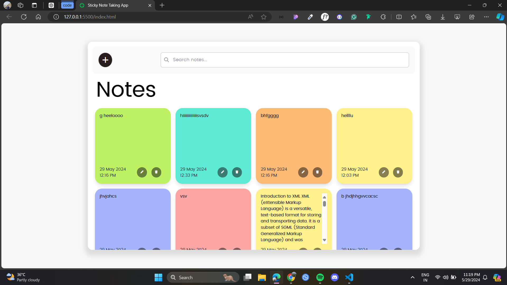

Certainly! Here's the updated README file with a placeholder for the screenshot of your app:

---

# Sticky Note Taking App

This is a modern sticky note taking application built with HTML, CSS, and JavaScript. It allows users to create, edit, and delete notes, with each note containing a timestamp of when it was created or last edited.

## Features

- **Create Notes**: Add new notes with custom text and background color.
- **Edit Notes**: Modify existing notes.
- **Delete Notes**: Remove notes that are no longer needed.
- **Search Notes**: Search through notes using the search bar.
- **Timestamps**: Each note displays the date and time it was created or last edited in the format "29 June 2024".

## Technologies Used

- HTML
- CSS (with TailwindCSS)
- JavaScript

## Getting Started

### Prerequisites

Ensure you have a modern web browser installed (e.g., Chrome, Firefox, Edge).

### Installation

1. Clone the repository or download the ZIP file.
    ```sh
    git clone https://github.com/yourusername/sticky-note-app.git
    ```
2. Navigate to the project directory.
    ```sh
    cd sticky-note-app
    ```

### Usage

1. Open the `index.html` file in your web browser.
2. To add a new note, click the "+" button. Fill in the note text and choose a color, then click "Create Note".
3. To edit a note, click the pencil icon on the note you want to edit. Modify the text or color and click "Save".
4. To delete a note, click the trash icon on the note you want to remove.
5. Use the search bar to filter notes by their text content.

### Screenshot



### File Structure

- `index.html`: The main HTML file.
- `style.css`: The main CSS file for styling.
- `script.js`: The main JavaScript file for functionality.

### Code Overview

#### HTML

The HTML file sets up the structure of the app, including the container for the notes and the popup for creating/editing notes.

#### CSS

The CSS file (using TailwindCSS) styles the app, providing a modern and responsive design.

#### JavaScript

The JavaScript file contains functions for:

- Creating notes
- Editing notes
- Deleting notes
- Displaying notes
- Searching notes

### Example Note Format

Each note contains:

- Text content
- Background color
- Date and time of creation/last edit

Example:
```html
<li class="p-4 rounded-3xl shadow-lg m-2 flex flex-col bg-yellow-200">
  <span class="note-date text-gray-500 text-sm">29 June 2024</span>
  <span class="note-time text-gray-500 text-sm">14:30</span>
  <span class="note-text flex-grow">This is a sample note.</span>
  <div id="noteBtns-container" class="flex justify-end mt-2">
    <button id="editBtn" onclick="editNote(1622540000000)" class="bg-blue-500 text-white p-1 rounded mr-1"><i class="fa-solid fa-pen"></i></button>
    <button id="deleteBtn" onclick="deleteNote(1622540000000)" class="bg-red-500 text-white p-1 rounded"><i class="fa-solid fa-trash"></i></button>
  </div>
</li>
```

### Contributing

Contributions are welcome! Please submit a pull request or open an issue to discuss your ideas.

### License

This project is licensed under the MIT License.

### Contact

Your Name - [your.email@example.com](mailto:prateeksinghchouhan007@gmail.com)

Project Link: [https://github.com/yourusername/sticky-note-app](https://github.com/yourusername/sticky-note-app)

---

Replace `path/to/your/screenshot.png` with the actual path to your screenshot file.

